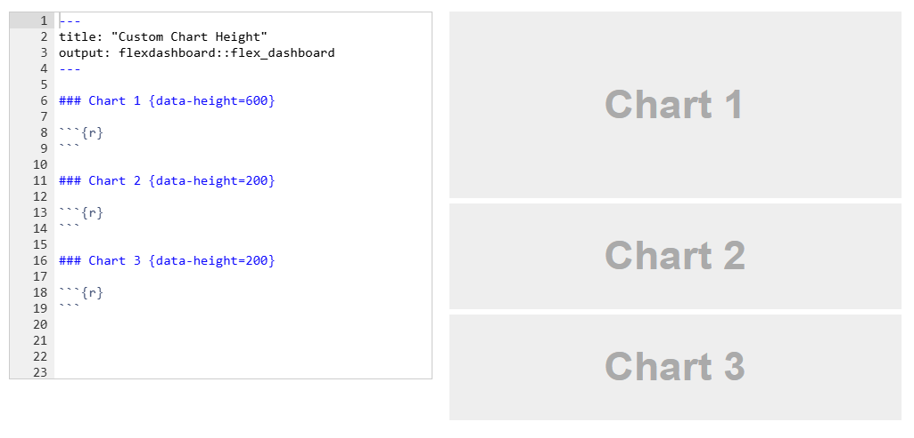
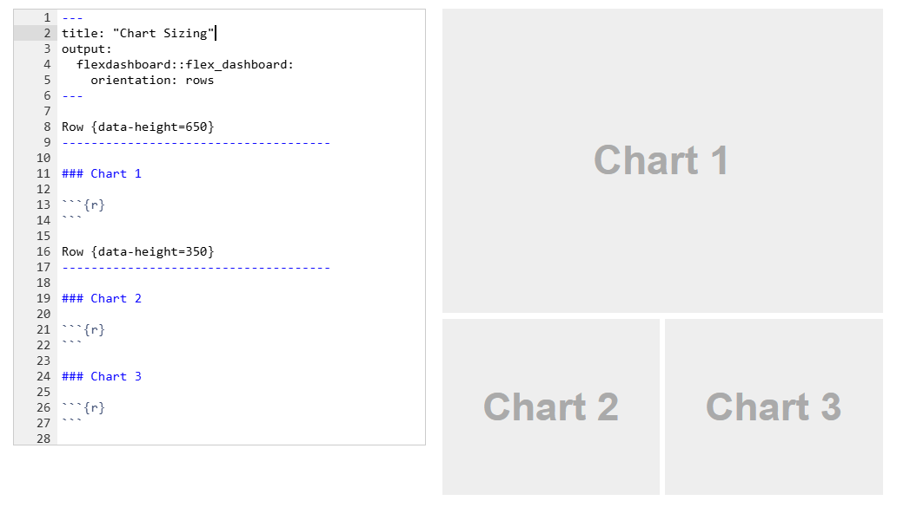
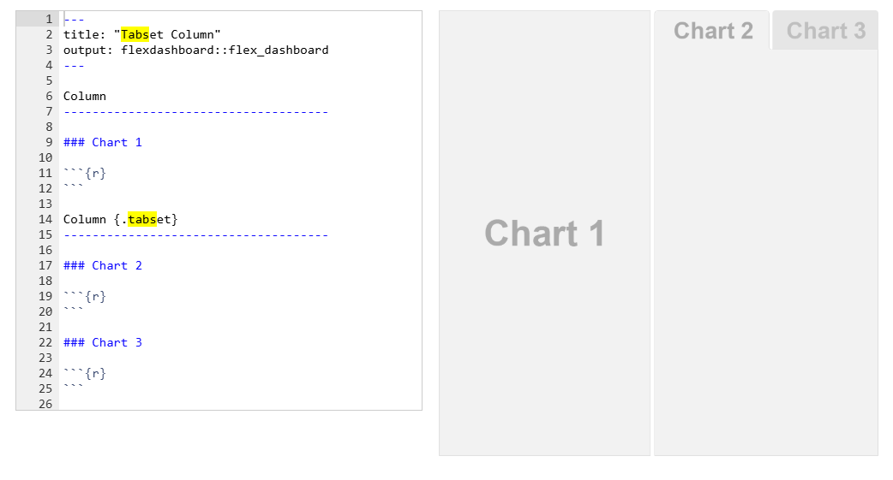

```{=html}
<style>
.h1,h2,h3 {
color:#2f1a61;
}

.subtitle, section.normal {
color:#291854;
}

.title {
color:#cc0065;
}

.nav-pills>li>a{
color: #2f1a61;
}

.nav-pills>li.active>a, .nav-pills>li.active>a:hover, .nav-pills>li.active>a:focus {
color: #fff;
background-color: #2f1a61;
}

.nav-tabs>li>a{
color: #2f1a61;
}

.nav-tabs>li.active>a, .nav-tabs>li.active>a:hover, .nav-tabs>li.active>a:focus {
color: #fff;
background-color: #2f1a61;
}

.pad-box{
padding: 1em;"
}
</style>
```

```{r setup, include=FALSE}
knitr::opts_chunk$set(echo = TRUE)
options(digits=2)

# save the built-in output hook
hook_output <- knitr::knit_hooks$get("output")

# set a new output hook to truncate text output
knitr::knit_hooks$set(output = function(x, options) {
  if (!is.null(n <- options$out.lines)) {
    x <- xfun::split_lines(x)
    if (length(x) > n) {
      # truncate the output
      x <- c(head(x, n), "....\n")
    }
    x <- paste(x, collapse = "\n")
  }
  hook_output(x, options)
})

colorise <- function(x, color) {
  if (knitr::is_latex_output()) {
    sprintf("\\textcolor{%s}{%s}", color, x)
  } else if (knitr::is_html_output()) {
    sprintf("<span style='color: %s;'>%s</span>", color,
      x)
  } else x
}

```

------------------------------------------------------------------------

Welcome back everyone! Today we will have a look at how to build interactive dashboards with flexdashboard and maps with leaflet.

------------------------------------------------------------------------

# Dashboards with `flexdashboard`

The goal of flexdashboard is to make it easy to create interactive dashboards for R, using R Markdown. A flexdashboard can either be static (a standard web page) or dynamic (a Shiny interactive document). A wide variety of components can be included in flexdashboard layouts, for a full list see [the documentation](https://pkgs.rstudio.com/flexdashboard/articles/flexdashboard.html).

As with Shiny apps, we are going to be working with the example in the folder `/flexdash`. We will use a slightly adapted version of this flexdashboard created by [Philipp Ottolinger](https://testing-apps.shinyapps.io/flexdashboard-leaflet-waste/).

------------------------------------------------------------------------

## Flexdashboard in practice 🏀

The big difference to Shiny apps is that the flexdashboard Rmd file will take over the function used to define the layout of the dashboard/app. In other words, the entire Rmd, now plays the role of `fluidPage()`.

So let's have a closer look at how you can structure a flexdashboard.

------------------------------------------------------------------------

## Columns and rows

Dashboards are divided into columns and rows, with output components delineated using level 3 markdown headers (`###`). By default, dashboards are laid out within a single column, with charts stacked vertically within a column and sized to fill available browser height.



<br>

If you want to change the dashboard to include multiple columns you can introduce the following (`--------------`).



<br>

If you want to change the dashboard to include multiple tabs you can use `{.tabset}`. 



<br>

In the YAML tab of the Rmd you can specify a number of additional properties:

-   `vertical_layout: scroll`
-   `orientation: rows`


Feeling overwhelmed? No need to come up with a fancy design all on your own. You can find a long list of templates [here](https://pkgs.rstudio.com/flexdashboard/articles/examples.html).

------------------------------------------------------------------------

## Shiny Components

To add Shiny components to a flexdashboard, you need `runtime: shiny` in your YAML header and the `shiny` library loaded.

### Input-Output Basics

You probably know this by now, but as a reminder: Shiny uses a reactive system where **inputs** (widgets) automatically trigger **outputs** (visualizations) to update.

**Common inputs:**

- `selectInput()` - dropdowns

- `sliderInput()` - sliders  

- `checkboxInput()` - checkboxes


**Common outputs:**

- `renderPlot()` - plots

- `renderLeaflet()` - maps

- `renderTable()` - tables

Each input needs an ID (first argument). Access it in outputs using `input$ID_NAME`.

### Where Things Go

In a **standalone Shiny app**, you'd define inputs in the `ui` and outputs in the `server` function. In **flexdashboard**, it's simpler:
- **Inputs** go in a column with the `{.sidebar}` attribute
- **Outputs** go in regular content panes (chart sections)


### Quick Example

```
# Input (in sidebar column)
selectInput("selected_year", "Choose Year:", choices = 2000:2010)

# Output (in chart section) - automatically updates when input changes
renderPlot({
  data |> 
    filter(year == input$selected_year) |>
    ggplot(aes(x = category, y = value)) +
    geom_col()
})
```


## A Real Example: Nuclear Waste Sites

Let's look at a complete flexdashboard to see how these pieces work together. This dashboard visualizes nuclear waste sites across the United States, showing their cleanup status and locations.

### What This Dashboard Does

The dashboard has three main components:

1. **A main map** showing all sites color-coded by cleanup status.
2. **A bar chart** showing the count of sites in each status category.
3. **A focused map** highlighting sites located on university campuses.


**Data preparation in the setup chunk:** loading the JSON data, unnesting nested data frames, creating color schemes, and inferring whether sites are on campuses. This runs once when the dashboard loads, not repeatedly.

**Layout structure:** the dashboard uses a two-column layout with `data-width` attributes to control sizing. The main map gets more space (650) while the sidebar charts get less (350).

**Interactive elements:**both maps use `popup` to show site details on click. The bar chart uses `plotly::ggplotly()` to convert a static ggplot into an interactive plotly chart with hover tooltips.


## Your Turn: Gapminder Dashboard

Time to build your own interactive flexdashboard! You'll create a dashboard exploring global development data from the gapminder package. 

Open the file `our-flex/gapminder_flex.Rmd` in the course materials. The file shows a basic map of Africa. Here are your tasks:

### Exercise 1

:::{.alert-info .pad-box}
- Load and explore the data - The `gapminder` package is already loaded. Inspect the dataset `gapminder` with `glimpse()` to see the structure. Then, create a new code chunk for data preparation. Filter gapminder for African countries only and year 2007. 
 
- Join the datasets - Join your filtered gapminder data to the `africa` boundaries (already loaded in setup). Figure out which columns to use for the join.

- Visualize life expectancy with colors - In the map code chunk, use your joined dataset in the `leaflet()` function. Color the polygons by adding the `fillColor` argument to `addPolygons()`. The structure is `fillColor = ~pal(variable_name)`. The palette `pal` is predefined in the setup chunk. Set `fillOpacity = 0.7` to make the colors visible.

- Finally, add a legend - Check out the nuclear waste sites dashboard for inspiration. Use `addLegend()` and specify: `pal` (the color palette), `values` (the variable you're mapping, with the format `~variable_name`), `title` (what to call it), and `position` (try "bottomleft").
:::


---

Phew! That was a lot. But now you've got a working map with real data. Let's make it interactive!

### Exercise 2


:::{.alert-info .pad-box}
Make your map interactive so users can select different years and see how life expectancy changed over time.

- Add a year selector - Create a sidebar section with `Column {.sidebar}` and add a `selectInput()` widget. Give it an id (you'll use this to access the selected value), a label like "Select Year:", and use `choices = unique(gapminder$year)` to populate all available years.

- Make the map reactive - Wrap your map code in `renderLeaflet({ })`. Move your data filtering inside this function and change the year filter to use `input$your_id_name` instead of a hardcoded year like 2007.

- Test it - Knit the document and try changing the year selector. The map should update automatically!
:::

<br>

:::{.alert-success}
**Hint:** Remember that code using `input$` values needs to be inside a `render*()` function to be reactive. Move your data filtering and joining inside `renderLeaflet()`, but keep the `africa` boundaries loading outside (it only needs to happen once).
:::


## Other Useful Widgets

Beyond leaflet maps, flexdashboard supports many interactive visualization libraries:

**Interactive tables:**
- `DT::datatable()` - sortable, filterable, searchable tables with pagination
- `reactable::reactable()` - modern interactive tables with customization

**Interactive plots:**
- `plotly::ggplotly()` - convert ggplot2 plots to interactive plotly charts
- `plotly::plot_ly()` - create plotly charts directly


For more examples and widgets, see the [HTML widgets showcase](https://www.htmlwidgets.org/showcase_leaflet.html).


------------------------------------------------------------------------

# <b style="color:#2f1a61">Acknowledgements</b> {.unnumbered}

The running example of the flexdashboard was adapted from [Waste Lands - America's forgotten nuclear legacy](https://testing-apps.shinyapps.io/flexdashboard-leaflet-waste/).

This script was drafted by [Tom Arendt](https://github.com/tom-arend) and [Lisa Oswald](https://lfoswald.github.io/), with contributions by [Steve Kerr](https://smkerr.github.io/), [Hiba Ahmad](https://github.com/hiba-ahmad), [Carmen Garro](https://github.com/cgarroca), and [Sebastian Ramirez-Ruiz](https://seramirezruiz.github.io/).
